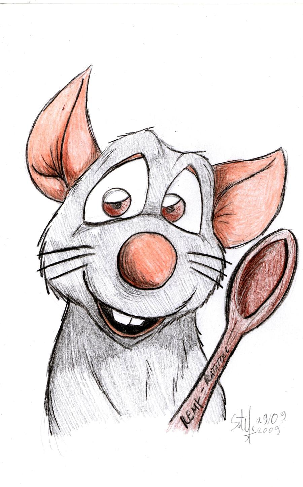

```{r setup, include=FALSE}
# aqui van todas las instrucciones generales
# paquetes a cargar
library(ggplot2)  # para graficos 
library(mvtnorm)  # distribucion normal bivariada
library(scatterplot3d) # graficos 3D
library(lattice)  # graficos 3D

 library(RSocrata) # importar datos de manera remota
 library(stringr)  # para trabajo con caracteres


# instrucciones generales para los graficos
# delacacion de colores a utilizar
c1="#002147" # 
c2="#325d8c" # 
c3="#6994bc" # 
c4="#95b9db" # 

```

# Titilo 1
## Titulo 2
### Titulo 3
#### Titulo 4
##### Titulo 5
###### Titulo 6

---
## Dos columnas
.pull-left[
### Columna 1

]


.pull-right[

### Columna 2

]

---

### Grafico

+ {r tidy= FALSE, eval=FALSE}

+ tidy : proporciona opciones de forma de las salidas
+ eval = FALSE , no evalua el codigo , solo lo presenta

```{r tidy=FALSE, eval=FALSE}
ggplot(mtcars) + 
     aes(mpg, disp) + 
     geom_point() +   #<<
     geom_smooth()    #<<
```

---
+ echo=FALSE , no presenta codigo

```{r tidy=FALSE, eval=TRUE, echo=FALSE}
ggplot(mtcars) + 
     aes(mpg, disp) + 
     geom_point() +   #<<
     geom_smooth()    #<<
```

---

+ warning=FALSE , evita que salgan mensajes de peligro
+ message =FALSE, evita los mensajes en las salidas

```{r tidy=FALSE, eval=TRUE, echo=FALSE, warning=FALSE, message=FALSE}
ggplot(mtcars) + 
     aes(mpg, disp) + 
     geom_point() +   #<<
     geom_smooth()    #<<
```

---
```{r echo = FALSE}
# remotes::install_github("gadenbuie/xaringanExtra")
xaringanExtra::use_panelset()
```
## Varios paneles en una sola diapositiva
.panelset[
.panel[.panel-name[panel 1]

## Contenido 1
  ]
.panel[.panel-name[panel 2]

## Contenido 2
  ]
.panel[.panel-name[panel 3]

## Contenido 3
  ]  
.panel[.panel-name[panel 4]

## Contenido 4
  ]  
.panel[.panel-name[panel 5]

## Contenido 5
  
  ]  
.panel[.panel-name[panel 6]

## Contenido 6
  
  ]
.panel[.panel-name[panel 7]

## Contenido 7
  ]  
]
---

## hipervinculo

https://github.com/dgonzalez80
---
### Adicionamar link

+ primmera forma: 
https://youtu.be/lRftK2mL3Sw

+ segunda forma:
[COMO DESCARGAR DATOS ABIERTOS](https://youtu.be/lRftK2mL3Sw)

+ tercera forma HTML : 
<a href="https://youtu.be/lRftK2mL3Sw">Link a video</a>


---

```{r}
# bloque de r
```

en los bloques

+ {r eval = TRUE}   : evalua codigo de R

+ {r echo = FALSE}   : no muestra el codigo pero ejecuta la instruccion 

---
# # Imagenes

- con estilo Markdown : 
 
---
# Imagenes continuacion...
forma HTML con escalamiento


---
# Imagen de internet
background-image:
url(https://media.giphy.com/media/iJDLBX5GY8niCpZYkR/giphy.gif)

---


---
class: center
# Videos en Youtube

<iframe width="900" height="500" src="https://www.youtube.com/embed/lRftK2mL3Sw" frameborder="0" allow="accelerometer; autoplay; clipboard-write; encrypted-media; gyroscope; picture-in-picture" allowfullscreen></iframe>


https://www.youtube.com/embed/lRftK2mL3Sw
---
<html>
<div class="container-wrapper-genially" style="position: relative; min-height: 400px; max-width: 100%;"><video class="loader-genially" autoplay="autoplay" loop="loop" playsinline="playsInline" muted="muted" style="position: absolute;top: 45%;left: 50%;transform: translate(-50%, -50%);width: 80px;height: 80px;margin-bottom: 10%"><source src="https://static.genial.ly/resources/panel-loader-low.mp4" type="video/mp4" />Your browser does not support the video tag.</video><div id="5f2ae96b94d21c0d831cdb4c" class="genially-embed" style="margin: 0px auto; position: relative; height: auto; width: 100%;"></div></div><script>(function (d) { var js, id = "genially-embed-js", ref = d.getElementsByTagName("script")[0]; if (d.getElementById(id)) { return; } js = d.createElement("script"); js.id = id; js.async = true; js.src = "https://view.genial.ly/static/embed/embed.js"; ref.parentNode.insertBefore(js, ref); }(document));</script>
</html>
---
class: inverse, center, middle

# Titulo centrado y en medio 
---
class: inverse
background-image: url("img/tree-276014_1920.jpg")

	<br/><br/><br/><br/><br/><br/><br/><br/><br/><br/><br/><br/><br/><br/><br/><br/><br/>
# <p style="color:blue"> Con trabajo lo podemos hace.... </p>

### <p style="color:blue"> Daniel Enrique González Gómez </p>

Imagen tomada de : https://pixabay.com/es/images/search/paisaje/
