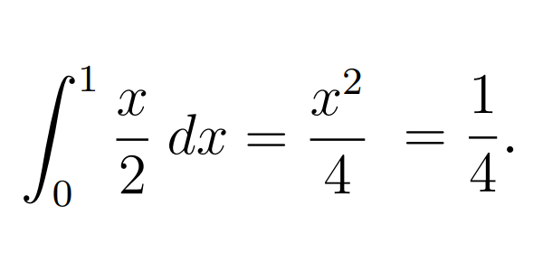
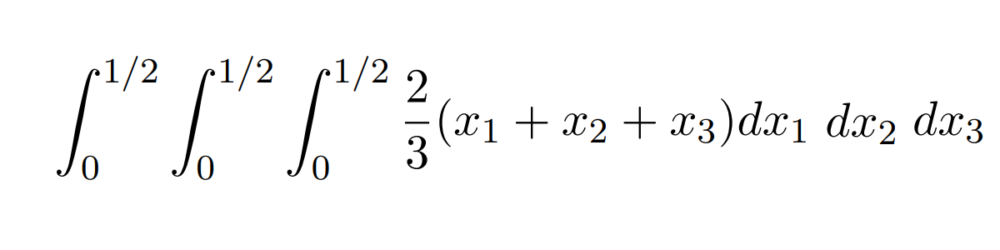

```{r setup, include=FALSE}

c1="#002147" # 
c2="#325d8c" # 
c3="#6994bc" # 
c4="#95b9db" # *
c5="#c4d5f2"
c6="#C8C8C8" # ***
c7="#8A8D8F"
```

<html>
<div class="container-wrapper-genially" style="position: relative; min-height: 400px; max-width: 100%;"><video class="loader-genially" autoplay="autoplay" loop="loop" playsinline="playsInline" muted="muted" style="position: absolute;top: 45%;left: 50%;transform: translate(-50%, -50%);width: 80px;height: 80px;margin-bottom: 10%"><source src="https://static.genial.ly/resources/panel-loader-low.mp4" type="video/mp4" />Your browser does not support the video tag.</video><div id="5f2ae96b94d21c0d831cdb4c" class="genially-embed" style="margin: 0px auto; position: relative; height: auto; width: 100%;"></div></div><script>(function (d) { var js, id = "genially-embed-js", ref = d.getElementsByTagName("script")[0]; if (d.getElementById(id)) { return; } js = d.createElement("script"); js.id = id; js.async = true; js.src = "https://view.genial.ly/static/embed/embed.js"; ref.parentNode.insertBefore(js, ref); }(document));</script>
</html>
---


### Sumatoria

```{r tidy=FALSE, eval=TRUE}
x=1:10
sum(x)        #<<
```

```{r tidy=FALSE, eval=TRUE}
x=c(1,2,3,4,5,6,7,8,9,NA)
sum(x)        #<<
```

```{r tidy=FALSE, eval=TRUE}
x=c(1,2,3,4,5,6,7,8,9,NA)
sum(x, na.rm = TRUE)        #<<
```
---
### Sumatoria

```{r tidy=FALSE, eval=TRUE}
# sumatoria acumulada
x=1:10
cumsum(x)     #<<    
```


$$\dfrac{\displaystyle\sum_{i=1}^{n}(x_{i}-\bar{x})^2}{n-1}$$

```{r tidy=FALSE, eval=TRUE}
x=1:10
sum((x-mean(x))^2)/(length(x)-1)   #<<  
var(x)
```
---
### Permutaciones - combinaciones
```{r tidy=FALSE, eval=TRUE}
# Permutacion
P=function(n,k){choose(n,k)*factorial(k)}   #<<
P(4,2)
```


```{r tidy=FALSE, eval=TRUE}
# Combinacion
C=function(n,k){choose(n,k)}  #<<
C(4,2)

```
---
### Permutaciones 
```{r tidy=FALSE, eval=TRUE}
library(gtools)
N=4  # Número de elementos
n=2  # grupos de 2 en 2
id=c(1:N) 
permutations(N, n, id)  #<<
cat("Total grupos : ", P(4,2))
```

---
### Combinaciones
```{r tidy=FALSE, eval=TRUE}
library(gtools)
N=5  # Número de elementos
n=2  # grupos de 2 en 2
id=c(1:N) 
combinations(N, n, id)  #<<
cat("Total grupos : ", C(5,2)) 
```
---
### Permutaciones en urna 
```{r tidy=FALSE, eval=TRUE}
library(gtools)
# urna con 3 bolas 
x <- c('Rojo', 'Azul', 'Verde')
permutations(n=3,r=2,v=x,repeats.allowed=TRUE)   #<<
```
---
### Gráficos de funciones 2D 

$$f(x)=\dfrac{x}{2}\hspace{.5cm}   0 \leq x \leq 1 $$
.pull-left[
```{r tidy=FALSE, eval=FALSE, fig.dim=c(7,7)}
par(cex=0.6, cex.axis=1.2, cex.lab=1.2, cex.main=2, cex.sub=2.5)
f=function(x){x/2}
x1=c(-0.1,2.1)
x2=c(0,1)
plot(x2~x1,type="p", xlab="x", ylab="y", col="white")
grid()

curve(f,0,2, add=TRUE, lwd=2)
t=seq(0,1,by=0.01)
x=c(0,t,1)
y=c(0,f(t),0)
polygon(x,y,
        col="#0000ff22")
abline(h=0,v=0) 
```
]

.pull-right[
```{r eval=TRUE, fig.dim=c(5,5), echo=FALSE, warning=FALSE}
par(cex=0.6, cex.axis=1.2, cex.lab=1.2, cex.main=2, cex.sub=2.5)
f=function(x){x/2}
x1=c(-0.1,2.1)
x2=c(0,1)
plot(x2~x1,type="p", xlab="x", ylab="y", 
     col="white",cex.axis=1.5, cex.names = 1.5,
     las=1)
curve(f,0,2, add=TRUE, lwd=2)
t=seq(0,1,by=0.01)
x=c(0,t,1)
y=c(0,f(t),0)
polygon(x,y,
        col="#0000ff22")
abline(h=0,v=0) 
```
]
---
### Gráficos 2D
$$f(x)= \dfrac{1}{22} exp\{-x/22\} \hspace{.5cm} x \geq 0  $$

.pull-left[ 
```{r tidy=FALSE, eval=FALSE}
library(ggplot2)
f=function(x){1/22*exp(-x/22)}
p9=ggplot(data.frame(x=c(0,100)),aes(x=x)) +
stat_function(fun=f,color="blue",size=1.5) +
ggtitle("Tiempo de reparación máquina")+
scale_x_continuous(name="tiempo en minutos" )+
scale_y_continuous(name="f(x)")
p9
```
]
.pull-right[
```{r tidy=FALSE, eval=TRUE, fig.dim=c(6,6), echo=FALSE}
library(ggplot2)
f=function(x){1/22*exp(-x/22)}
p9<-ggplot(data.frame(x=c(0,100)),aes(x=x))+
stat_function(fun=f,color="blue",size=1.5)+
ggtitle("Tiempo de reparación máquina" )+
scale_x_continuous(name="tiempo en minutos")+
scale_y_continuous(name="f(x)" )
p9
```

]

---
### Gráficos de funciones 3D 
.pull-left[ 
```{r tidy=FALSE, eval=FALSE}
library("mvtnorm")
N=50
x <- seq(-3,3, length=N)
y <- seq(-3,3,length=N)
z <- matrix(0, N, N)
for (i in 1:N) for (j in 1:N) {
  z[i,j]=dmvnorm(c(x[i],y[j]), c(0,0),
        matrix(c(1,0.5,0.5,1),2,2))}
persp(x,y,z,theta=50, phi=10, 
      xlab=" ", 
      ylab=" ", 
      zlab=" ",
      scale=TRUE,
      expand=.4,
      axes=FALSE)
```

]
.pull-right[
```{r eval=TRUE, fig.dim=c(10,10), echo=FALSE, warning=FALSE}
library("mvtnorm")
N=50
x <- seq(-3,3, length=N)
y <- seq(-3,3,length=N)
z <- matrix(0, N, N)
for (i in 1:N) for (j in 1:N) {
  z[i,j]=dmvnorm(c(x[i],y[j]), c(0,0),
        matrix(c(1,0.5,0.5,1),2,2))}
persp(x,y,z,theta=50, phi=10, 
      xlab=" ", 
      ylab=" ", 
      zlab=" ",
      scale=TRUE,
      expand=.4,
      axes=FALSE)
```
]
.footnote[[*]  Cual es la función?]

---
### Gráficos de funciones 3D 

$$f(x,y)= x+y $$
.pull-left[
```{r tidy=FALSE, eval=FALSE }
library(scatterplot3d)
x=c(0,1,1,0,0) 
y=c(0,0,1,1,0)
z=c(0,1,2,1,0) 
s=scatterplot3d(x,y,z, type='l',xlim=c(0,1),ylim=c(0,1),zlim=c(0,2), angle=45,xlab="x", ylab="y", zlab="z",scale.y=0.4, grid = FALSE,label.tick.marks=TRUE)
x0=c(0,1,1)
y0=c(0,0,0)
z0=c(0,0,1)
polygon(s$xyz.convert(x0,y0,z0),col="#8080FF99") 
x1=c(0,1,0)
y1=c(0,0,1) 
z1=c(0,1,1)
polygon(s$xyz.convert(x1,y1,z1),col="#8080FF99") 
x2=c(0,0,0)
y2=c(0,1,1)
z2=c(0,0,1) 
polygon(s$xyz.convert(x2,y2,z2),col="#8080FF99") 
x3=c(0,1,0)
y3=c(0,0,1)
z3=c(0,0,0)
polygon(s$xyz.convert(x3,y3,z3),col="#8080FF99") 
```
]

.pull-right[
```{r tidy=FALSE, eval=TRUE, fig.dim=c(7,7), echo=FALSE}
library(scatterplot3d)
x=c(0,1,1,0,0) ; y=c(0,0,1,1,0); z=c(0,1,2,1,0) 
s=scatterplot3d(x,y,z, type='l',xlim=c(0,1),ylim=c(0,1),zlim=c(0,2), angle=45,xlab="x", ylab="y", zlab="z",scale.y=0.4, grid = FALSE,label.tick.marks=TRUE)
x0=c(0,1,1); y0=c(0,0,0); z0=c(0,0,1)
polygon(s$xyz.convert(x0,y0,z0),col="#8080FF99") 
x1=c(0,1,0); y1=c(0,0,1) ; z1=c(0,1,1)
polygon(s$xyz.convert(x1,y1,z1),col="#8080FF99") 
x2=c(0,0,0); y2=c(0,1,1); z2=c(0,0,1) 
polygon(s$xyz.convert(x2,y2,z2),col="#8080FF99") 
x3=c(0,1,0); y3=c(0,0,1); z3=c(0,0,0)
polygon(s$xyz.convert(x3,y3,z3),col="#8080FF99")  
```
]
---
### Gráficos de funciones 3D 

$$f(x,y)= \dfrac{48 xy}{49}$$

.pull-left[ 
```{r tidy=FALSE, eval=FALSE}
library(lattice)
x=seq(3,4,by=0.02)
y=seq(0.5,1,by=0.02)
fun=function(x,y){48*x*y^2/49}
z=outer(x,y,fun)
wireframe(z,xlab="x",ylab="y",col="blue")  #<<
```
]
.pull-right[
```{r tidy=FALSE, eval=TRUE, echo=FALSE, fig.dim=c(6,6)}
  library(lattice)
x=seq(3,4,by=0.02)
y=seq(0.5,1,by=0.02)
fun=function(x,y){48*x*y^2/49}
z=outer(x,y,fun)
wireframe(z,xlab="x",ylab="y",col="blue")  #<<
```
]

.footnote[[*]  Cual es la función? ]
---
### Integración


.pull-left[

```{r tidy=FALSE, eval=FALSE}
 f=function(x){x/2} #<<
curve(f,0,2) # dibuja linea de la función
abline(h=0,v=0) # traza eje x y eje y
t=seq(0,1,by=0.01)
x=c(0,t,1)
y=c(0,f(t),0)
polygon(x,y,density=30, col="#8080FF99") # pinta área sombreada
p=integrate(f,0,1) #<<
p$value # resultado
```
]
.pull-right[
```{r tidy=FALSE, eval=TRUE, echo=FALSE, fig.dim=c(5,5)}
 f=function(x){x/2}  #<<
curve(f,0,2) # dibuja linea de la función
abline(h=0,v=0) # traza eje x y eje y
t=seq(0,1,by=0.01)
x=c(0,t,1)
y=c(0,f(t),0)
polygon(x,y,density=30, col="#8080FF99") # pinta área sombreada
p=integrate(f,0,1) #<<
p$value # resultado
```
]
---
### Integración- triples

.pull-left[ 

```{r tidy=FALSE, eval=FALSE}
library(cubature)
f=function(x){2/3*(x[1]+x[2]+x[3])}
adaptIntegrate(f,lowerLimit=c(0,0,0),       #<<
               upperLimit=c(0.5,0.5,0.5))   #<<
```

]
.pull-right[
```{r tidy=FALSE, eval=TRUE, echo=FALSE}
library(cubature)
f=function(x){2/3*(x[1]+x[2]+x[3])}
adaptIntegrate(f,lowerLimit=c(0,0,0),upperLimit=c(0.5,0.5,0.5))   #<<
```
]

---
.pull-left[


```{r tidy=FALSE, eval=FALSE}
 library(RSocrata)
 library(stringr)
 token ="ew2rEMuESuzWPqMkyPfOSGJgE"
  Colombia= read.socrata("https://www.datos.gov.co/resource/gt2j-8ykr.json", app_token = token)
 Colombia$sexo=str_to_lower(Colombia$sexo)
 Colombia$estado[Colombia$estado=="N/A"]="NA"
 Colombia$estado=str_to_lower(Colombia$estado)
 Colombia$recuperado[Colombia$recuperado=="N/A"]="NA"
 Colombia$recuperado=str_to_lower(Colombia$recuperado)
 Colombia$fuente_tipo_contagio[Colombia$fuente_tipo_contagio=="N/A"]="NA"
 Colombia$fuente_tipo_contagio=str_to_lower(Colombia$fuente_tipo_contagio)
 Colombia$ubicacion[Colombia$ubicacion=="N/A"]="NA"
 Colombia$ubicacion=str_to_lower(Colombia$ubicacion)
  saveRDS(Colombia,"data/Colombia202105.RDS")  
```

```{r tidy=FALSE, eval=TRUE}
 Colombia=readRDS("data/Colombia.RDS") 
```

]
n
.pull-right[
```{r tidy=FALSE, eval=TRUE, fig.dim=c(5,4)}
par(cex=0.8, cex.axis=1, cex.lab=1, cex.main=1, cex.sub=1)
t=table(Colombia$ubicacion) # table en frecuencias abs
t=prop.table(t)*100         # tabla en porcentaje
t=round(t,2)                # tabla en porcentaje 2 decimales 
labs=names(t)               # nombres de las categorias
barplot(t,main=" Distribución contagiados de Covid-19 por ubicación",ylim = c(0,100),xlab ="Ubicación", ylab="Porcentaje",beside=T,col=c(c1,c2,c3,c4,c5),las=1)
legend("topright", inset = 0.1,labs,fill =c(c1,c2,c3,c4,c5),cex =1)
```
]

```{r tidy=FALSE, eval=TRUE}
t=prop.table(table(Colombia$ubicacion)) #<<  
```
---
## Primer dia de clases
.pull-left[ 
```{r tidy=FALSE, eval=FALSE}
library(RColorBrewer) # paquete  colores
library(readxl) # paquete leer archivos excel
bd0052 <- read_excel("data/bd0052.xlsx",sheet = "base20211", col_types = c("numeric", "numeric", "text", "numeric",  "text", "numeric"))
bd0052$carrera[bd0052$carrera=="Biologia"]="Biología"
bd0052$carrera[bd0052$carrera=="Ingenieria Civil"]="Ingeniería Civil"
```

```{r tidy=FALSE, eval=FALSE}
attach(bd0052)
t1011=table(carrera,grupo)
knitr::kable(t1011)
barplot(t1011,col = brewer.pal(6,"Set1"))
```

```{r tidy=FALSE, eval=FALSE}
p1012<-ggplot(bd005NA, aes(x=grupo, y=promacum)) + geom_boxplot(fill = "palegreen", color = "blue4",                      size=0.5, outlier.color = "blue4", outlier.size = 2)+
  geom_jitter(color="black", size=0.4, alpha=0.9)
p1012  
```

]
.pull-right[


]
---
## Problema de los dados

.pull-left[ 
```{r tidy=FALSE, eval=FALSE}
sample(1:6,1) #<<
```

```{r tidy=FALSE, eval=TRUE, echo=FALSE}
sample(1:6,1)
```

```{r tidy=FALSE, eval=FALSE}
sample(1:6, 10, replace = TRUE) #<<
```

```{r tidy=FALSE, eval=TRUE, echo=FALSE}
sample(1:6, 10, replace = TRUE)
```

```{r tidy=FALSE, eval=FALSE}
dd=sample(1:6, 20, replace = TRUE)
mdd=matrix(dd,ncol = 2)
apply(mdd, 1,sum) #<<
```

```{r tidy=FALSE, eval=TRUE, echo=FALSE}
dd=sample(1:6, 20, replace = TRUE)
mdd=matrix(dd,ncol = 2)
apply(mdd, 1,sum)

```

```{r tidy=FALSE, eval=FALSE}
#  ?sample
sample(x,size,replace=FALSE,prob=NULL)
```
]
.pull-right[


.footnote[[*] tomado de: https://weloversize.com/compras-por-menos-de-10e-para-mejorar-tus-polvazos/]
]
---
## Problema de los dados
.pull-right[

]n
.pull-left[ 


```{r tidy=FALSE, eval=TRUE}
n=5
dd=sample(1:6, n*2, replace = TRUE)
mdd=matrix(dd,ncol = 2)
mdd
```


```{r tidy=FALSE, eval=FALSE}
n=5
dd=sample(1:6, n*2, replace = TRUE)
mdd=matrix(dd,ncol = 2)
sdd=apply(mdd, 1,sum)
barplot(table(sdd), las=1)
prop.table(table(sdd))
```


]
.pull-right[
```{r tidy=FALSE, eval=TRUE, fig.dim=c(4,4), echo=FALSE}
sdd=apply(mdd, 1,sum)
barplot(table(sdd), col=c1)
```

```{r tidy=FALSE, eval=TRUE, echo=FALSE}
prop.table(table(sdd))
```
] 

---
## Problema de los dados
.pull-right[

]
.pull-left[ 
```{r tidy=FALSE, eval=FALSE}
n=10000
dd=sample(1:6, n*2, replace = TRUE)
mdd=matrix(dd,ncol = 2)
sdd=apply(mdd, 1,sum)
barplot(table(sdd))
prop.table(table(sdd))
```
]
.pull-right[
```{r tidy=FALSE, eval=TRUE, fig.dim=c(7,5), echo=FALSE}
n=10000
dd=sample(1:6, n*2, replace = TRUE)
mdd=matrix(dd,ncol = 2)
sdd=apply(mdd, 1,sum)
barplot(prop.table(table(sdd)), col=c2, las=2)
```
] 

```{r tidy=FALSE, eval=TRUE, echo=FALSE}
n=10000
dd=sample(1:6, n*2, replace = TRUE)
mdd=matrix(dd,ncol = 2)
sdd=apply(mdd, 1,sum)
prop.table(table(sdd))
```

---

.pull-left[ 


]
.pull-right[
```{r tidy=FALSE, eval=FALSE}
# binomial
dbinom(x, size, prob)
pbinom(q, size, prob, lower.tail = TRUE)
qbinom(p, size, prob, lower.tail = TRUE)
rbinom(n, size, prob)
# Poisson
dpois(x, lambda)
ppois(q, lambda, lower.tail = TRUE)
qpois(p, lambda, lower.tail = TRUE)
rpois(n, lambda)
# geometrica
dgeom(x, prob)
pgeom(q, prob, lower.tail = TRUE)
qgeom(p, prob, lower.tail = TRUE)
rgeom(n, prob)

?rnorm
```
] 
---
### Modelos especiales - gráficos
```{r echo = FALSE}
# remotes::install_github("gadenbuie/xaringanExtra")
xaringanExtra::use_panelset()
```

.panelset[
.panel[.panel-name[binomial]
  
.pull-left[
```{r tidy=FALSE, eval=FALSE}
library(ggplot2)
x=0:9
fx=dbinom(x,9,0.90)
dat=data.frame(x,fx)
ggplot(dat) + 
  geom_point(aes(x, fx),
             colour = "orange", size = 4) +
  scale_x_contins(limits = c(0, 10),
             breaks = c(0,1,2,3,4,5,6,7,8,9), 
             labels = c('0','1','2','3','4','5','6','7','8','9'))
```
]
.pull-right[
```{r tidy=FALSE, eval=TRUE, echo=FALSE, fig.dim=c(6,4)}
x=0:9
fx=dbinom(x,9,0.90)
dat=data.frame(x,fx)
ggplot(dat) + 
  geom_point(aes(x, fx),colour = "orange", size = 4) +
  scale_x_continuous(limits = c(0, 10),
                     breaks = c(0,1,2,3,4,5,6,7,8,9), 
                     labels = c('0','1','2','3','4','5','6','7','8','9'))
```
]
]
.panel[.panel-name[Poisson]
  
.pull-left[
```{r tidy=FALSE, eval=FALSE}
library(ggplot2)
x=0:10n
fx=dpois(x,2)
dat=data.frame(x,fx)
ggplot(dat) + geom_point(aes(x, fx),colour = "orange", size = 4) +
  scale_x_continuous(limits = c(0, 10),
                     breaks = c(0,1,2,3,4,5,6,7,8,9,10), 
                     labels = c('0','1','2','3','4','5','6','7','8','9','10'))
```
]

.pull-right[
```{r tidy=FALSE, eval=TRUE, echo=FALSE, fig.dim=c(6,4)}
x=0:10
fx=dpois(x,2)
dat=data.frame(x,fx)
ggplot(dat) + geom_point(aes(x, fx),colour = "orange", size = 4) +
  scale_x_continuous(limits = c(0, 10),
                     breaks = c(0,1,2,3,4,5,6,7,8,9,10), 
                     labels = c('0','1','2','3','4','5','6','7','8','9','10'))
```
]  
]
.panel[.panel-name[uniforme c.]
  
.pull-left[
```{r tidy=FALSE, eval=FALSE}
library(ggplot2)
x= c(0,1) 
fx=c(1,1) 
dat=data.frame(x,fx)
require(ggplot2)
ggplot(data=dat,aes(x=x, y=fx))+ 
  scale_y_continuous(limits=c(0,1.2))+
  geom_line(size = 1)
```
]

.pull-right[
```{r tidy=FALSE, eval=TRUE, echo=FALSE, fig.dim=c(6,4)}
  x= c(0,1) 
fx=c(1,1) 
dat=data.frame(x,fx)
require(ggplot2)
ggplot(data=dat,aes(x=x, y=fx))+ 
       scale_y_continuous(limits=c(0,1.2))+
      geom_line(size = 1)
```
]  
]  
.panel[.panel-name[normal]
  
.pull-left[
```{r tidy=FALSE, eval=FALSE}
library(ggfortify)
p=ggdistribution(dnorm,            # funcion
                 seq(-4, 8, 0.1), # rango de x  
                 mean=0,          # media
                 sd=1,            # desviacion estandar 
                 colour='blue')   # color 
p=ggdistribution(dnorm,seq(-4, 8, 0.1),mean=0,sd=1.5,colour='red',p=p)
ggdistribution(dnorm,seq(-4, 8, 0.1),mean=2,sd=1.5,colour='orange',p=p)
```
]

.pull-right[
```{r tidy=FALSE, eval=TRUE, echo=FALSE, fig.dim=c(6,4)}
library(ggfortify)
  p=ggdistribution(dnorm, seq(-4, 8, 0.1), mean = 0, sd = 1,colour = 'blue')
p=ggdistribution(dnorm, seq(-4, 8, 0.1), mean = 0, sd = 1.5,colour = 'red', p=p)
ggdistribution(dnorm, seq(-4, 8, 0.1),   mean = 2, sd = 1.5,colour = 'orange', p=p)
```
]  
]  
.panel[.panel-name[exponencial]

.pull-left[
```{r tidy=FALSE, eval=FALSE}
library(ggfortify)
p=ggdistribution(dexp, seq(0, 10, 0.1),rate=1 ,colour = 'blue')
p=ggdistribution(dexp, seq(0, 10, 0.1),rate=2 ,colour = 'red', p=p)
ggdistribution(dexp, seq(0, 10, 0.1),rate=0.5,colour = 'orange', p=p)
```
]
.pull-right[
```{r tidy=FALSE, eval=TRUE, echo=FALSE, fig.dim=c(6,4)}
library(ggfortify)
p=ggdistribution(dexp, seq(0, 10, 0.1),rate=1 ,colour = 'blue')
p=ggdistribution(dexp, seq(0, 10, 0.1),rate=2 ,colour = 'red', p=p)
ggdistribution(dexp, seq(0, 10, 0.1),rate=0.5,colour = 'orange', p=p)
```
]
]  
.panel[.panel-name[Weibull]

.pull-left[
```{r tidy=FALSE, eval=FALSE}
library(ggfortify)
p=ggdistribution(dweibull, seq(0, 5, 0.01),shape=0.8,scale=1 ,colour = 'blue')
p=ggdistribution(dweibull, seq(0, 5, 0.01),shape=2,scale=1 ,colour = 'red', p=p)
ggdistribution(dweibull, seq(0, 5, 0.01),shape=2,scale=2,colour = 'orange', p=p)
```
]

.pull-right[
```{r tidy=FALSE, eval=TRUE, echo=FALSE, fig.dim=c(6,4)}
library(ggfortify)
p=ggdistribution(dweibull, seq(0, 5, 0.01),shape=0.8,scale=1 ,colour = 'blue')
p=ggdistribution(dweibull, seq(0, 5, 0.01),shape=2,scale=1 ,colour = 'red', p=p)
ggdistribution(dweibull, seq(0, 5, 0.01),shape=2,scale=2,colour = 'orange', p=p)

```
]
]

.panel[.panel-name[gamma]
.pull-left[
```{r tidy=FALSE, eval=FALSE}
library(ggfortify)
p=ggdistribution(dgamma, seq(0, 15, 0.1),shape=3,rate=1 ,colour= 'blue')
p=ggdistribution(dgamma, seq(0, 15, 0.1),shape=2,rate=1 ,colour = 'red', p=p)
ggdistribution(dgamma, seq(0, 15, 0.1),shape=5,rate=1,colour = 'orange', p=p)
```
]
.pull-right[
```{r tidy=FALSE, eval=TRUE, echo=FALSE, fig.dim=c(6,4)}
library(ggfortify)
p=ggdistribution(dgamma, seq(0, 15, 0.1),shape=3,rate=1 ,colour= 'blue')
p=ggdistribution(dgamma, seq(0, 15, 0.1),shape=2,rate=1 ,colour = 'red', p=p)
ggdistribution(dgamma, seq(0, 15, 0.1),shape=5,rate=1,colour = 'orange', p=p)
```
]
]  
]

---
### Modelos especiales

En **R** los nombres de las funciones diseñadas para los cálculos requeridos están conformadas por dos partes: 
+ La primera parte con el propósito de la función (primera letra) 
+ La segunda parte hace referencia al modelo a utilizar ( en el caso binomial binom)

| letra    | detalle                                   |
|:--------:|:------------------------------------------|
|	**p**    | función de distribución acumulada $F(x)$  |
|	**q**    | percentil                                 | 
|	**d**    | densidad de probabilidad $P(X=x)$         |
|	**r**    | variable aleatoria                        |

Para variables aleatoria discreta con distribución binomial $X\sim b(x;20,0.30)$
$P(X=7)=\dbinom{20}{7} 0.30^{7} (10.30)^{(20-7)}$ 
```{r tidy=FALSE, eval=FALSE, echo=TRUE}
dbinom(7, 20, 0.30) #<<  # P(X = 7)
pbinom(7, 20, 0.30) #<<  # P(X  <= 7)
qbinom(0.25, 20, 0.30) #<<  Percentil 25
```

---
####   Experimento de Montecarlo

Es un método no determinista o estadístico numérico, usado para aproximar expresiones matemáticas complejas y costosas de evaluar con exactitud. El método se llamó así en referencia al Casino de Montecarlo (Mónaco) por ser “la capital del juego de azar”, al ser la ruleta un generador simple de números aleatorios. El nombre y el desarrollo sistemático de los métodos de Montecarlo datan aproximadamente de 1944 y se mejoraron enormemente con el desarrollo de la computadora.  

El uso de los métodos de Montecarlo como herramienta de investigación, proviene del trabajo realizado en el desarrollo de la bomba atómica durante la Segunda Guerra Mundial en el Laboratorio Nacional de Los Álamos en EE. UU. Este trabajo conllevaba la simulación de problemas probabilísticos de hidrodinámica concernientes a la difusión de neutrones en el material de fisión. Esta difusión posee un comportamiento eminentemente aleatorio.	
(tomado de Wikipedia) 

**Ejemplo** : Se fabrican placas rectangulares cuyas longitudes en pulgadas se distribuyen como $N(2.0; 0.01)$ y cuyos anchos se distribuyen $N(3.0; 0.04)$. Suponga que las longitudes y los anchos son independientes. El área de una placa esta dada por $A=XY$. (Problema 3 capitulo 4 Navidi(2006))
+ [a.] Utilice una muestra simulada de tamaño $1000$ para estimar la media y la varianza de $A$.
+ [b.] Estime la probabilidad de que $P(5.9 <A<6.1)$.
+ [c.] Construya una gráfica de distribución normal $(qqplot)$ para el área. ¿El área de una placa sigue una distribución normal? 


---

```{r tidy=FALSE, eval=FALSE}
	X2=rnorm(1000,mean=2.0,sd=0.1)    #  generación de numeros aleatorios  de X
	Y2=rnorm(1000,mean=3.0,sd=0.2)    #  generacion de numeros aleatorios  deY
	Z2=data.frame(X2,Y2)              #  generacion de matriz de X,Y
	A2=apply(Z2,1,prod)               #  area de la placa A=XY
	mediaA=mean(A2)                   #  media del vector de areas 
	varianzaA=var(A2)                 #  varianza del vector de areas 
	B2=as.numeric(A2>5.9 & A2<6.1)    #  generacion de variable de 0,1, 
	#  con 1 donde cumplecondicion   
	Pro3c=sum(B2)/1000                #  calculo de la  probabilidad 
	hist(A2)                          # histograma del valor de las areas
	plot(density(A2))                 # grafico de la distribucion empirica de A2
	qqnorm(A2)                        # grafico QQ de A2
	summarytools::descr(A2)
```
---

.pull-left[

]
.pull-right[
A2  
N: 1000  

| Descriptive Statistics |        A2 |
|------------------------| --------- |
|    Mean                | 6.00      |
|    Std.Dev             | 0.50      |
|    Min                 | 4.27      |
|    Q1                  | 5.67      |
|    Median              |6.00       |
|    Q3                  |6.33       |
|    Max                 |7.52       |
|    MAD                 |0.49       |
|    IQR                 |0.66       |
|    CV                  |0.08       |
|    Skewness            |0.04       |
|    SE.Skewness         |0.08       |
|    Kurtosis            |-0.05      |
|    N.Valid             |1000.00    | 
|    Pct.Valid           |100.00     |

]

---
### Concepto de correlación

.pull-left[
```{r tidy=FALSE, eval=FALSE, echo=TRUE}
gen.corr.data<- function(rho,n){
 x <- rnorm(n);  
 z <- rnorm(n); 
 y<- rho*x + sqrt(1-rho^2)*z ; result <-cbind(y,x)
  return(result)
}
par(mfrow = c(2, 2)) # matriz de graficos 2x2
muestra<-gen.corr.data(0,200);   plot(muestra, pch=19, main = "Correlació Rho=0");     grid()
muestra<-gen.corr.data(0.7,200); plot(muestra, pch=20, main = "Correlació Rho=0.7");grid()
muestra<-gen.corr.data(0.9,200); plot(muestra, pch=20, main = "Correlació Rho=0.9");grid()
muestra<-gen.corr.data(-0.6,200); plot(muestra, pch=20, main = "Correlación Rho=-0.6"); grid()
```

myCompiler

https://www.mycompiler.io/online-r-compiler
]
.pull-right[

]

---
###  Teorema Central del Límite
.pull-left[ 


```{r tidy=FALSE, eval=FALSE}
n=200 ; m=1000*n
# distribucion exponencial-------------------------------
X=matrix(rexp(m,1),ncol=n)
# generacion de muestras---------------------------------
X1=X[ ,1]  ; X2=X[ ,1:2]; ; X20=X[ ,1:20] ; X200=X[ ,1:200] 
# generacion de medias---------------
Mx2=apply(X2,1,mean); Mx20=apply(X20,1,mean); Mx200=apply(X200,1,mean)  
# histogramas  de comparacion--------------------------
par(mfrow=c(2,2),cex=0.8, cex.axis=1, cex.lab=1, cex.main=1, cex.sub=1, las=1)
hist(X1,  main = "n=1", freq=FALSE)
hist(Mx2, main ="n=2", freq=FALSE) 
hist(Mx20, main = "n=20",freq=FALSE) 
hist(Mx200, main = "n=200", freq=FALSE) 
```
]
.pull-right[

]
---
### Pruebas de hipotesis

```{r tidy=FALSE, eval=FALSE}
# Codigos R
t.test(x, y = NULL,
       alternative = c("two.sided", "less", "greater"),
       mu = 0, paired = FALSE, var.equal = FALSE,
       conf.level = 0.95, ...)

 prop.test(x, n, p = NULL,
          alternative = c("two.sided", "less", "greater"),
          conf.level = 0.95, correct = TRUE)

 var.test(x, y, ratio = 1,
         alternative = c("two.sided", "less", "greater"),
         conf.level = 0.95, ...)
```

---

### Prueba t-Student para una media , con distribucion normal
$Ho:\mu \leq 1000$ 
$Ha:\mu > 1000$

```{r tidy=FALSE, eval=FALSE}
x=c(11.1, 15.6, 11.1,  7.5,  7.9, 14.7,  6.3,  8.5,  8.0 , 7.6)
t.test(x,                          #<<
       alternative = "less",      #<<  
       mu = 10,                   #<<
       conf.level = 0.95)
```


```{r tidy=FALSE, eval=TRUE, echo=FALSE}
x=c(11.1, 15.6, 11.1,  7.5,  7.9, 14.7,  6.3,  8.5,  8.0 , 7.6)
t.test(x,
       alternative = "less",
       mu = 10,
       conf.level = 0.95)
```
---
### Prueba no parametrica de Signos
$Ho:Me \leq 15$ 

$Ha:Me > 15$

```{r tidy=FALSE, eval=FALSE}
# install.packages("BSDA")
library(BSDA)
x=c(16,15,12,17,18,14,16,14,16,17,19,16,14,21,20,16,16,16)
SIGN.test(x,md=15,alternative = "greater") #<<
```


```{r tidy=FALSE, eval=FALSE, echo=TRUE}
	One-sample Sign-Test

data:  x
s = 13, p-value = 0.02452
alternative hypothesis: true median is greater than 15
95 percent confidence interval:
  16 Inf
sample estimates:
median of x 
         16 
```


---
class: inverse, center, middle

# Práctica 

https://github.com/dgonzalez80/ACEdEstad2021/blob/main/codigoR/codigo3.R
